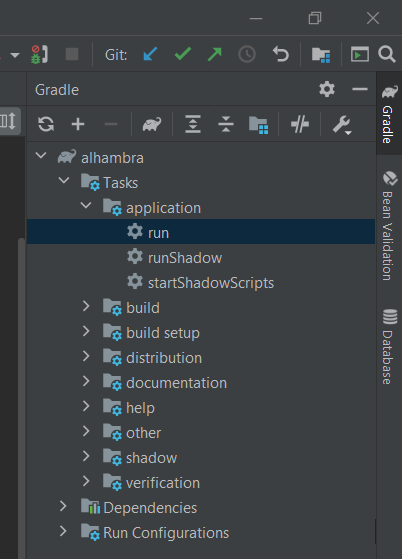

# Alhambra web project (Server)

This application forms the backend of my school project
with as objective to make a web application out of the board game Alhambra.

The technology used is Java together with Gradle.

The WebServer class was setup beforehand by the lector together
with the scaffolding of the OpenAPI3Bridge class. All other classes were made by me
or members of my project group.

## Launch

To run this application, only a double click on the `run` button is
needed under the Gradle tab of your editor.

The editor I used for this project is IntelliJ.

